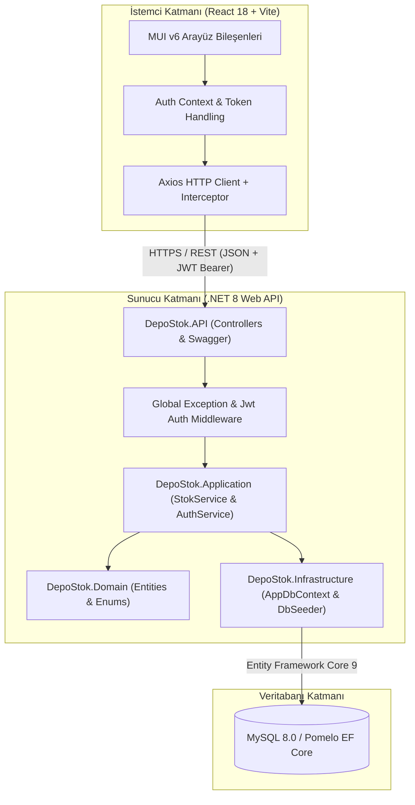
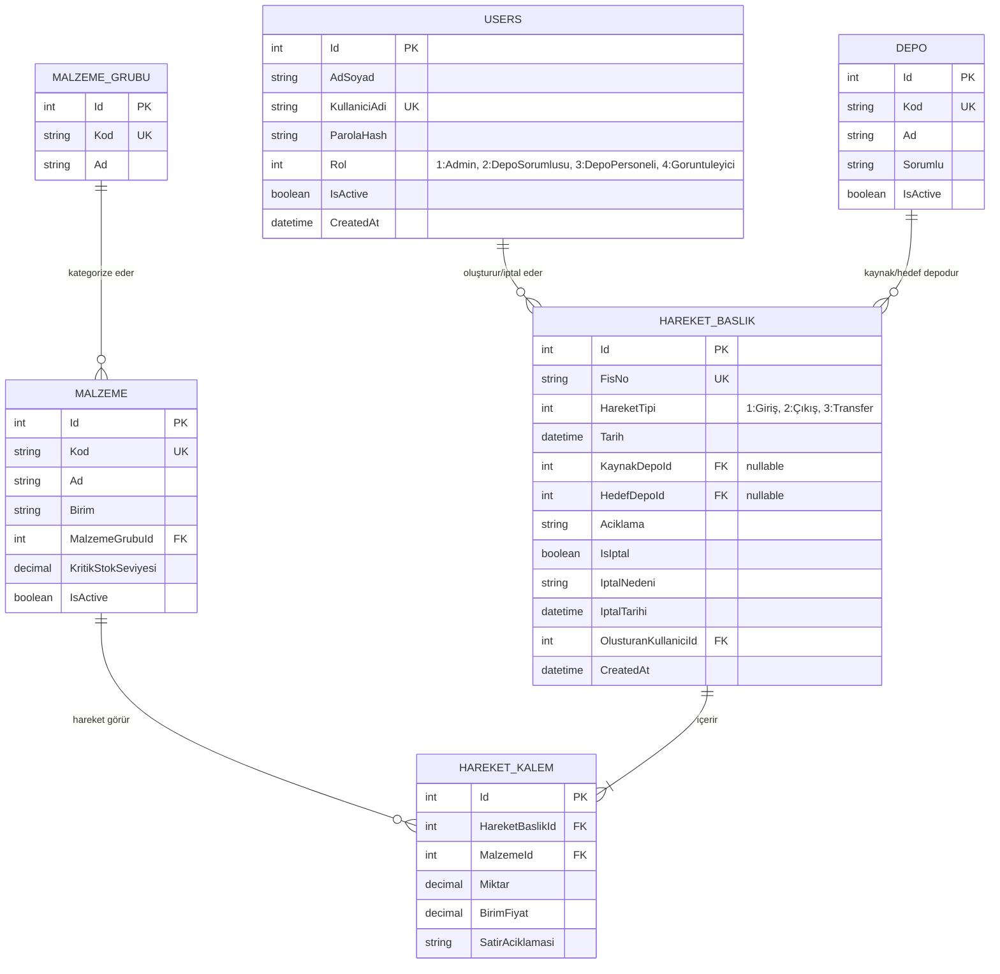

# YAZILIM MİMARİSİ VE TASARIM DOKÜMANI (SOFTWARE ARCHITECTURE DOCUMENT - SAD)

**Proje Kodu**: YM-02  
**Proje Adı**: Depo ve Stok Hareketleri Modülü  
**Mimari Desen**: Katmanlı Mimari (Layered Architecture) / Clean-Lite Architecture  
**Sürüm**: v1.0.0  

---

## 1. Giriş ve Mimari Amaçlar

Bu doküman, **Depo ve Stok Hareketleri Modülü (YM-02)** yazılımının teknik mimarisini, katman katman bileşen sorumluluklarını, veritabanı tasarımını, iş kurallarını ve güvenlik yaklaşımını detaylandırmaktadır.

### Temel Mimari Prensipler (Architectural Drivers)
1. **Veri Tutarlılığı (Data Consistency & Integrity)**: Giriş, Çıkış ve Transfer hareketlerinin stok bakiyesini kesin doğrulukla güncellemesi.
2. **Negatif Stok Engelleme**: Hiçbir şartta depoda fiziken bulunmayan miktarın çıkışının yapılamaması.
3. **İzlenebilirlik ve İptal (Audit & Traceability)**: Fiziksel silme yerine izleme kayıtları ve `IsIptal` durum bayrağı ile geriye dönük stok geçmişinin (Kartoteks) korunması.
4. **Güvenlik ve Yetkilendirme (RBAC & JWT)**: Rol tabanlı yetki kontrolünün sunucu tarafında zorunlu kılınması ve kimlik doğrulaması.

---

## 2. Genel Sistem Mimarisi

Sistem, **İstemci (Client)**, **API / Uygulama Katmanı** ve **İlişkisel Veritabanı** olmak üzere 3 ana katmandan oluşan katmanlı mimariye sahiptir.

---

## 3. Katman Bileşenleri ve Sorumlulukları

### 3.1. Frontend Katmanı (`frontend/`)
- **React 18 + Vite**: Yüksek performanslı Single Page Application (SPA).
- **Material UI (MUI)**: Kurumsal tablo, modal, form ve grafik bileşen seti.
- **Axios Interceptor**: Tüm HTTP isteklerine `Authorization: Bearer <token>` ekler. `401 Unauthorized` durumunda kullanıcıyı otomatik çıkış yaptırıp Login ekranına yönlendirir.
- **Role-Based Protected Route**: Kullanıcının rolüne göre menü öğelerini ve sayfa erişimlerini koruma altına alır.

### 3.2. API Katmanı (`DepoStok.API`)
- **Controllers**: HTTP isteklerini karşılar, DTO doğrulamasını yapar ve servis katmanına aktarır.
- **Swagger / OpenAPI**: API uç noktalarını ve JWT test ortamını dokümante eder.
- **Serilog**: Günlük sistem hareketlerini ve hataları `logs/depostok-.log` dosyalarına yazar.

### 3.3. İş / Uygulama Katmanı (`DepoStok.Application`)
- **`StokService`**: Stok bakiyesi hesaplama, negatif bakiye kontrolü, `DbTransaction` ile atomik transfer, stok iptali ve yürüyen bakiye (Kartoteks) algoritmalarını yürütür.
- **`AuthService`**: Parola doğrulama (BCrypt) ve 60 dakikalık JWT Bearer Token üretimi.
- **DTOs**: İstemci ile API arasındaki veri transfer sözleşmelerini tanımlar.

### 3.4. Altyapı ve Domain Katmanı (`DepoStok.Infrastructure` & `DepoStok.Domain`)
- **`AppDbContext`**: EF Core veri eşleşmeleri, tablo indeksleri ve ilişkiler.
- **`DbSeeder`**: Veritabanı sıfırdan oluşturulduğunda 4 kullanıcı, 5 grup, 4 depo, 105 malzeme ve 300+ hareketi yükleyen script.

---

## 4. Veritabanı Mimarisi ve ER Diyagramı

---

## 5. Kritik İş Mantığı ve Matematiksel Modeller

### 5.1. Anlık Stok Bakiyesi Hesabı Formülü
Bir malzemenin ($m$) belirli bir depodaki ($d$) anlık kullanılabilir stok bakiyesi ($B_{m,d}$), iptal edilmemiş ($IsIptal = false$) tüm hareketlerden türetilir:

$$B_{m,d} = \sum (\text{Giriş Miktarları}_{\text{HedefDepo}=d}) - \sum (\text{Çıkış Miktarları}_{\text{KaynakDepo}=d})$$

### 5.2. Yürüyen Bakiye (Running Total / Kartoteks) Hesabı
Seçilen bir malzeme için zaman serisine göre satır satır bakiyenin birikimli hesaplanması:

$$\text{Yürüyen Bakiye}_i = \text{Yürüyen Bakiye}_{i-1} + (\text{Giriş}_i - \text{Çıkış}_i)$$

### 5.3. Eşzamanlılık ve Negatif Stok Engelleme (Race Condition Protection)
Çıkış ve Transfer işlemlerinde sunucu tarafında atomik `DbTransaction` başlatılır:
1. `GetAnlikBakiyeAsync(malzemeId, kaynakDepoId)` sorgulanır.
2. Eğer $B_{m,d} < \text{İstenen Çıkış Miktarı}$ ise işlem derhal geri alınır (`Rollback`) ve `InvalidOperationException("Yetersiz Stok!")` hatası döndürülür.
3. Transfer hareketlerinde kaynak depodan düşüm ve hedef depoya ekleme **TEK BİR TRANSACTION** içerisinde tamamlanır (`Commit`).

---

## 6. Güvenlik Tasarımı (Security Architecture)

- **JWT Kimlik Doğrulama**: 60 dakikalık token ömrü. Kullanıcı rolü claim olarak token içerisinde taşınır.
- **Salted Password Hash**: Parolalar `BCrypt.Net` algoritması ile salt eklenerek hash'lenir.
- **Yatay Yetki İhlali (IDOR) Engeli**: Kullanıcı kimliği istemci parametrelerinden değil, yalnızca doğrulanmış JWT Claim üzerinden alınır.
- **SQL Enjeksiyon Koruması**: Ham metin SQL birleştirme yasaktır; tüm sorgular EF Core LINQ parametrik yapısıyla çalışır.

---

## 7. Doküman Onayı ve Saklama

Bu mimari doküman, **YM-02 Depo ve Stok Hareketleri Modülü** projesinin teknik altyapı referans belgesidir. Proje dizininde `docs/YAZILIM_MIMARISI_DOKUMANI.md` konumunda saklanmaktadır.
